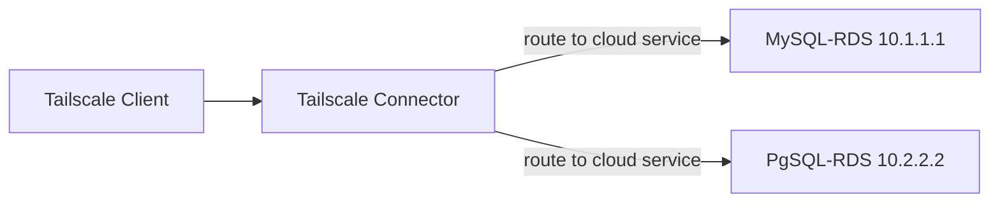

# Tailscale JIT Access with GitHub Actions 🚀

This repository demonstrates how to implement **Just-in-Time (JIT) access** for Tailscale using **GitHub Actions** and **GitOps ACLs**. By leveraging Tailscale's ACLs stored in a Git repository, you can request and grant temporary access to specific users dynamically.

---

## 📌 How It Works

There are two different types of **Just-in-Time (JIT) access requests** in this repository:

- **Kubernetes Permission Request**
- **Cloud Service Permission Request**

### Cloud Service Connection Diagram


1. User submits a request via GitHub Actions for **JIT** access.
2. A GitHub Actions workflow automatically **updates the ACL policy** and create a pull request in your repository.
3. Manual approval the pull request and the modified ACLs are committed and pushed to the Git repository, triggering **Tailscale ACL updates**.
4. A GitHub scheduled job runs every 5 minutes to automatically revoke the **expired** permissions.

---

## 🛠️ Prerequisites

Before setting up JIT access, ensure you have setup [GitOps ACLs with Tailscale](https://tailscale.com/kb/1306/gitops-acls-github).

---

## 📁 Project Directory Structure

This repository contains the following structure:
```
.
├── default.hujson
├── policy.hujson
└── jit/
```
- **`default.hujson`**: This is the base Tailscale ACLs file.

- **`policy.hujson`**:  This file is the result of merging the `default.hujson` file with all files in the `jit/` folder. 

- **`jit/`**: This folder is used to store files for just-in-time access requests.
